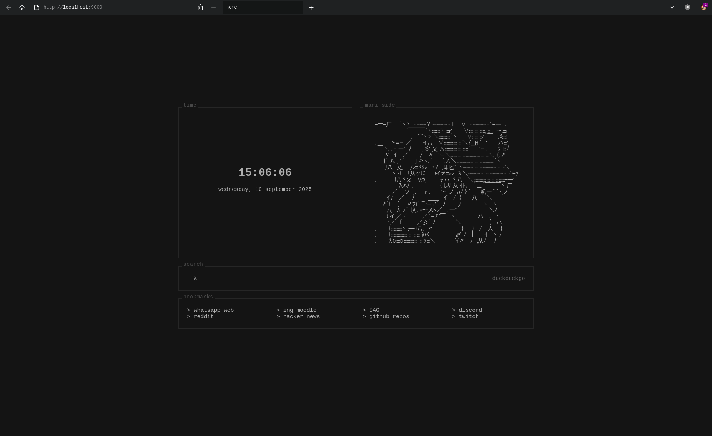

# homepage
Simple browser homepage, loosely based on [tilde](https://github.com/xvvvyz/tilde).

Menant to be self hosted in a local http server. Preferably nginx.

Features a terminal like search prompt, bookmarks, a clock and random ASCII art.

## Screenshots
 
